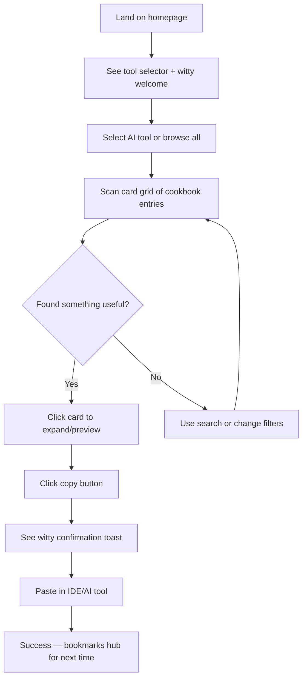
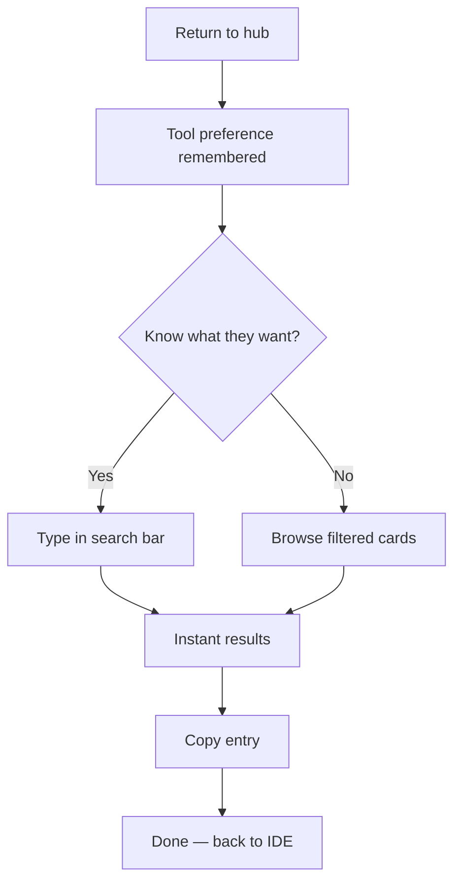
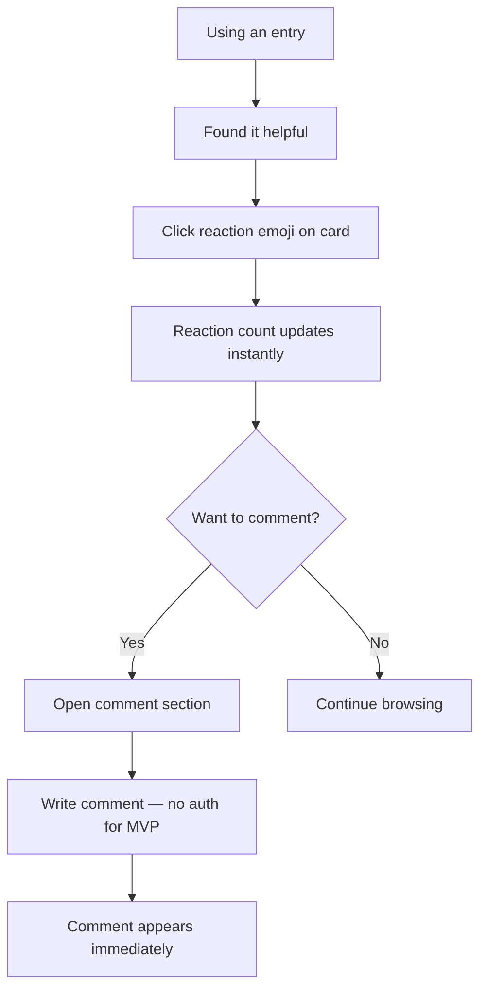

# UX Design Specification - bmad-demo

**Author:** Einat
**Date:** 2026-03-01

---

## Executive Summary

### Project Vision

bmad-demo is a Developer Hub — a curated toolkit for AI-assisted development featuring an AI Cookbook with prompts, snippets, and workflows for Claude, Copilot, Cursor, and Qodo. The UX differentiator is a personality-driven experience with witty microcopy and a chatty, playful tone that makes developer tooling feel approachable and fun rather than dry and utilitarian.

### Target Users

Developers actively using AI coding tools across varying experience levels — from those just exploring AI-assisted development to power users juggling multiple AI tools daily. They value practical utility, quick access to content, and appreciate personality in their tools when it doesn't get in the way of productivity.

### Key Design Challenges

1. **Competing with developer habits** — Developers already have bookmarks, snippets, and workflows. The hub must offer enough added value (curation, discoverability, community reactions) to justify a new tool in their stack.
2. **Content density vs. scannability** — Cookbook entries contain code, explanations, and metadata. Balancing information richness with quick scanning is critical for a desktop-first developer audience.
3. **Personality without annoyance** — The witty microcopy and playful UI must enhance the experience without slowing users down or feeling gimmicky after repeated use.

### Design Opportunities

1. **Personality as differentiator** — Most developer tools are sterile. A distinctive voice and playful interactions can create memorable brand identity and emotional connection.
2. **Copy-first interaction model** — Since the core action is copying prompts/snippets, optimizing the copy-and-use flow can create a signature "effortless" interaction.
3. **Progressive discovery** — Reactions, comments, and cross-tool content can surface organically as users explore, rewarding deeper engagement without overwhelming first-time visitors.

## Core User Experience

### Defining Experience

The core experience is a browse-copy-use loop: developers land, scan curated cookbook entries filtered by their AI tool of choice, and copy prompts/snippets with a single click. The hub serves as a launchpad — users spend seconds finding what they need, not minutes reading documentation.

### Platform Strategy

Desktop-first Angular SPA optimized for mouse/keyboard workflows. No offline requirements. Static JSON content for MVP ensures fast load times and simple deployment. Responsive but not mobile-optimized — developers use this alongside their IDE.

### Effortless Interactions

- One-click copy with visual confirmation (the signature interaction)
- Tool-based filtering (Claude/Copilot/Cursor/Qodo) persists across sessions
- Instant search/filter with no page reloads
- Reactions with a single click, no auth barriers for MVP

### Critical Success Moments

- First copy: user finds a useful prompt within 30 seconds of landing
- "This is better": discovering cross-tool variants of the same task
- Return trigger: remembering the hub when stuck on an AI prompt

### Experience Principles

1. **Copy is king** — Every design decision optimizes the path from discovery to clipboard
2. **Scan, don't read** — Content structure enables instant assessment of relevance
3. **Personality enhances, never blocks** — Witty microcopy adds flavor without adding friction
4. **Tool-aware context** — UI adapts to selected AI tool, showing relevant content first

## Desired Emotional Response

### Primary Emotional Goals

- **"This is fun AND useful"** — The rare combo where personality enhances productivity
- **Empowered** — Users feel like they've found a secret weapon for AI-assisted development
- **Amused** — Witty microcopy earns genuine smiles, not eye-rolls

### Emotional Journey Mapping

- **Discovery**: Curiosity + pleasant surprise ("this isn't another boring dev tool")
- **First copy**: Instant gratification — found something useful fast
- **Browsing**: Flow state — scanning feels effortless, personality keeps it engaging
- **After task**: Accomplishment — "that was easier than writing it myself"
- **Error/empty state**: Amused, not frustrated — personality shines in error messages
- **Return visit**: Familiarity + anticipation — "wonder what's new"

### Micro-Emotions

- **Confidence over confusion** — Clear content structure, obvious next actions
- **Delight over mere satisfaction** — Copy confirmations, witty empty states, playful transitions
- **Belonging over isolation** — Reactions/comments create "others found this useful too" feeling
- **Trust over skepticism** — Curated quality signals that content actually works

### Design Implications

- Confidence → Clean visual hierarchy, prominent tool filters, clear copy buttons
- Delight → Animated copy confirmation, personality in microcopy, playful hover states
- Belonging → Visible reaction counts, community engagement signals
- Trust → Quality badges, "tested with" indicators, version/date metadata

### Emotional Design Principles

1. **Earn the smile** — Every piece of witty copy must also be informative
2. **Reward speed** — Fast task completion = positive emotional reinforcement
3. **Fail with charm** — Errors and empty states are opportunities for personality
4. **Signal community** — Show that others use and value this content

## UX Pattern Analysis & Inspiration

### Inspiring Products Analysis

**1. Linear (Project Management)**
- Ultra-clean, keyboard-first interface with zero visual noise
- Monospace typography + muted palette = techy without trying hard
- Instant transitions, no loading spinners — everything feels immediate
- Calm confidence: the UI trusts the user, no hand-holding

**2. Vercel Dashboard**
- Developer-native aesthetic: dark/light themes, code-style typography
- Information density done right — lots of data, zero clutter
- Immediate feedback on every action (deploy status, logs)
- Clean card patterns with clear hierarchy

**3. Stripe Docs**
- Gold standard for readable developer content
- Code blocks with one-click copy, syntax highlighting
- Calm, spacious layout that doesn't overwhelm
- Left nav + content area pattern scales beautifully

### Transferable UX Patterns

- **Navigation**: Sidebar filtering (like Stripe Docs) + instant search (like Linear)
- **Content Cards**: Clean card grid with tool badge, title, preview, copy button (like Vercel)
- **Typography**: Monospace for code, clean sans-serif for prose — techy but readable
- **Interaction**: Keyboard shortcuts for power users, subtle animations for feedback
- **Color**: Muted palette with accent colors per AI tool — calm but identifiable

### Anti-Patterns to Avoid

- Cluttered dashboards with competing CTAs (breaks "calm")
- Heavy animations or transitions (breaks "immediate")
- Decorative elements that don't serve function (breaks "clean")
- Small or cramped text in code blocks (breaks "readable")
- Bright/saturated color schemes (breaks "calm" and "techy")

### Design Inspiration Strategy

- **Adopt**: Linear's keyboard-first speed + Stripe's readable content layout
- **Adapt**: Vercel's card patterns simplified for cookbook entries
- **Unique twist**: Layer the witty microcopy personality onto this calm, techy foundation — personality lives in the words, not the visuals

## Design System Foundation

### Design System Choice

**Tailwind CSS** as the design system foundation for the Angular monorepo. Utility-first approach enables rapid, consistent styling with full control over the techy, calm aesthetic — no component library abstractions to override.

### Rationale for Selection

- **Full visual control** — Achieve the Linear/Vercel-inspired aesthetic without fighting opinionated component styles
- **Monorepo friendly** — Shared Tailwind config across libs/apps ensures design consistency
- **Angular compatible** — Works seamlessly with Angular's component architecture and encapsulation
- **Performance** — PurgeCSS built in, only ships used styles
- **Matches "immediate" goal** — No runtime CSS-in-JS overhead, instant renders

### Implementation Approach

- **Nx monorepo** with shared Tailwind preset in a `libs/shared/styles` library
- **Custom design tokens** via `tailwind.config.ts`: colors, spacing, typography, shadows
- **Headless UI patterns** — Build accessible components (dropdowns, modals, tooltips) with Tailwind + Angular CDK where needed
- **Component library** — Internal `libs/ui` with reusable Tailwind-styled Angular components

### Customization Strategy

- **Typography**: `Inter` / `Geist Sans` for prose, `JetBrains Mono` / `Fira Code` for code — configured as Tailwind font families
- **Color palette**: Muted, desaturated base with distinct accent per AI tool (Claude purple, Copilot blue, Cursor teal, Qodo green)
- **Spacing**: Generous whitespace — `space-y-6` as default section spacing for calm, breathable layout
- **Dark/light**: Tailwind's `dark:` variant with CSS custom properties for theme switching

## Defining Core Experience

### Defining Experience

**"Find it. Copy it. Use it."** — The bmad-demo experience distilled. Users browse curated cookbook entries for their AI tool, copy with one click, and paste directly into Claude/Copilot/Cursor/Qodo. The entire interaction should feel like reaching into a well-organized toolbox.

### User Mental Model

- **Current approach**: Developers bookmark blog posts, save snippets in notes apps, or re-type prompts from memory — scattered and unreliable
- **Mental model they bring**: "cookbook" / "cheat sheet" — a reference they scan, grab from, and close
- **Expectation**: Instant access, no signup walls, no tutorials — it should work like a well-organized bookmarks folder but better
- **Frustration point**: If finding content takes longer than writing it from scratch, the hub fails

### Success Criteria

- User finds a relevant entry within 30 seconds of landing
- Copy action completes in one click with clear visual confirmation
- Tool filter reduces noise to only relevant content immediately
- Return visits feel faster than first visit (remembered preferences)
- Zero learning curve — no onboarding needed

### Novel UX Patterns

**Approach: Established patterns with a personality twist**
- Browse/filter/copy is a proven pattern (Stack Overflow, DevDocs, cheat sheets)
- **Unique twist #1**: Witty microcopy layered onto the calm, techy UI — personality in words, not visuals
- **Unique twist #2**: Per-tool context switching — content adapts to selected AI tool
- **Unique twist #3**: Community reactions on individual entries — social proof without full social features
- No user education needed — the patterns are immediately familiar

### Experience Mechanics

**1. Initiation**: User lands → sees tool selector (Claude/Copilot/Cursor/Qodo) prominently at top → selects their tool or uses remembered preference

**2. Interaction**: Browse card grid or use instant search → scan entry titles + previews → expand for full content → click copy button

**3. Feedback**: Copy button animates → brief toast/snackbar with witty confirmation ("Copied! Go make something cool.") → entry shows "copied" state briefly

**4. Completion**: Content is in clipboard → user switches to their IDE/AI tool → pastes and uses → returns when they need another prompt

## Visual Design Foundation

### Color System

**Base palette**: Neutral grays with cool undertone (slate family in Tailwind)
- **Background**: `slate-50` (light) / `slate-950` (dark)
- **Surface**: `slate-100` / `slate-900` for cards and panels
- **Text**: `slate-900` / `slate-50` for primary, `slate-500` for secondary

**AI Tool Accent Colors** (muted, desaturated):
- Claude: `violet-500` / `violet-400`
- Copilot: `sky-500` / `sky-400`
- Cursor: `teal-500` / `teal-400`
- Qodo: `emerald-500` / `emerald-400`

**Semantic**: `green-500` success, `amber-500` warning, `red-500` error
- All colors meet WCAG AA contrast ratios against their backgrounds

### Typography System

- **Prose**: `Inter` (or `Geist Sans`) — clean, modern, excellent readability at all sizes
- **Code**: `JetBrains Mono` — ligatures for code clarity, monospace for alignment
- **Scale**: `text-sm` (14px) body, `text-base` (16px) emphasis, `text-lg`→`text-3xl` headings
- **Line height**: `leading-relaxed` for body, `leading-tight` for headings
- **Weight**: `font-normal` body, `font-medium` labels, `font-semibold` headings

### Spacing & Layout Foundation

- **Base unit**: 4px (`space-1`), primary spacing in multiples of 8px
- **Layout**: Single-column content area with collapsible sidebar filter panel
- **Card spacing**: `gap-4` between cards, `p-5` internal padding
- **Section spacing**: `space-y-8` between major sections
- **Max content width**: `max-w-6xl` centered — prevents overly wide lines
- **Grid**: CSS Grid for card layouts, responsive columns (`grid-cols-1 md:grid-cols-2 lg:grid-cols-3`)

### Accessibility Considerations

- All text meets WCAG AA contrast (4.5:1 for body, 3:1 for large text)
- Focus-visible rings on all interactive elements (`ring-2 ring-offset-2`)
- Keyboard navigation for all actions (copy, filter, search, react)
- Reduced motion support via `motion-safe:` prefix on animations
- Semantic HTML throughout — proper headings, landmarks, ARIA labels

## Design Direction Decision

### Design Directions Explored

Given the clear alignment on techy, clean, calm, immediate — and the Linear/Vercel/Stripe inspiration — one cohesive direction emerged rather than competing alternatives:

**"Developer Calm"** — A minimal, content-forward layout that puts cookbook entries center stage with zero visual distraction.

### Chosen Direction

- **Layout**: Top nav (logo + search + tool selector) → main content area with card grid → collapsible sidebar for filters/categories
- **Cards**: Clean white/dark surface, subtle border, tool accent color as left border stripe, title + preview + copy button + reaction count
- **Interaction**: Hover lifts card slightly (`shadow-md`), copy button appears prominently, click expands inline or opens detail panel
- **Empty states**: Witty microcopy with minimal illustration ("No prompts for that yet. Want to be the first to suggest one?")
- **Overall feel**: Like a well-organized IDE sidebar — everything in its place, nothing competing for attention

### Design Rationale

- Matches all 4 design keywords: techy (monospace + code blocks), clean (minimal chrome), readable (generous spacing + type scale), immediate (no loading states, instant filter), calm (muted palette + whitespace)
- Single direction avoids decision fatigue — the vision is clear from our previous steps
- Prioritizes content over chrome — the cookbook entries ARE the experience

### Implementation Approach

- Build a shared `libs/ui` component library starting with: Card, ToolSelector, CopyButton, SearchBar, FilterSidebar, Toast
- Establish Tailwind preset with all design tokens before building pages
- Desktop-first responsive: 3-col grid → 2-col → 1-col
- Dark mode as a toggle, light mode default

## User Journey Flows

### Journey 1: First-Time Discovery → First Copy

**Entry**: Direct link, search engine, or shared URL
**Time to value**: < 30 seconds from landing to first copy
**Key moment**: The copy confirmation toast — first personality touchpoint

### Journey 2: Returning User → Quick Grab

**Entry**: Bookmarked URL or browser history
**Time to value**: < 15 seconds — faster than first visit
**Key moment**: Remembered preferences make it feel personal

### Journey 3: Engagement → React & Comment

**Key moment**: Seeing others' reactions validates the content quality

### Journey Patterns

- **Progressive engagement**: Browse → Copy → React → Comment (each step optional, deeper engagement rewarded)
- **Instant feedback**: Every action gets immediate visual response (no spinners, no delays)
- **Persistent context**: Tool selection, search state, and scroll position preserved across interactions
- **Recovery**: Search always accessible, "clear filters" one click away, back button works naturally

### Flow Optimization Principles

1. **Zero-click defaults** — Show useful content immediately on landing, no setup required
2. **One-click actions** — Copy, react, and filter all require exactly one click
3. **Keyboard shortcuts** — `/` for search, `Esc` to close, arrow keys to navigate cards
4. **No dead ends** — Every empty state suggests an action ("Try a different tool" or "Search for something else")

## Component Strategy

### Design System Components

**From Angular CDK** (headless, accessible primitives):
- Overlay (dropdowns, tooltips, modals)
- A11y (focus trap, live announcer)
- Clipboard API integration
- Scrolling (virtual scroll for large lists)

**From Tailwind** (utility classes, not components):
- All visual styling via design tokens in `tailwind.config.ts`
- No pre-built components — full control over every element

### Custom Components

**CookbookCard** — The core UI element
- Purpose: Display a single cookbook entry in the grid
- Anatomy: Tool accent stripe | Title | Preview text | Tags | Copy button | Reaction count
- States: Default, hover (elevated shadow), expanded, copied (brief success state)
- Keyboard: Enter to expand, `c` to copy when focused

**ToolSelector** — AI tool filter bar
- Purpose: Filter content by AI tool (Claude/Copilot/Cursor/Qodo)
- Anatomy: Horizontal chip bar with tool icons + labels, "All" option
- States: Active tool highlighted with accent color, multi-select not needed
- Persists selection in localStorage

**CopyButton** — The signature interaction
- Purpose: One-click copy to clipboard with personality
- States: Default (icon), hover (label appears), copying (animation), copied (checkmark + witty toast)
- Accessibility: `aria-label="Copy prompt to clipboard"`, announces "Copied" to screen readers

**SearchBar** — Instant search
- Purpose: Real-time filtering of cookbook entries
- Anatomy: Search icon | Input | Clear button | Result count
- Behavior: Debounced input (150ms), instant filter, keyboard shortcut `/` to focus

**FilterSidebar** — Category/tag navigation
- Purpose: Browse by category, difficulty, use case
- Anatomy: Collapsible sections with checkbox filters
- States: Expanded/collapsed, active filters shown as chips above grid

**Toast** — Feedback notifications
- Purpose: Confirm actions with personality
- Behavior: Auto-dismiss after 3s, stack if multiple, witty copy rotates
- Accessibility: `role="status"`, `aria-live="polite"`

**ReactionBar** — Community engagement
- Purpose: Quick emoji reactions on entries
- Anatomy: 3-4 preset emoji options + count per emoji
- States: Default, user-reacted (highlighted), animating count increment

### Component Implementation Strategy

- All components live in `libs/ui` as standalone Angular components
- Each component has its own Tailwind-based styles (no external CSS)
- Storybook for component development and documentation
- All components are accessible by default (keyboard, ARIA, focus management)

### Implementation Roadmap

**Phase 1 — MVP Core**: CookbookCard, ToolSelector, CopyButton, SearchBar, Toast
**Phase 2 — Navigation**: FilterSidebar, category chips, breadcrumbs
**Phase 3 — Engagement**: ReactionBar, CommentSection, share functionality

## UX Consistency Patterns

### Button Hierarchy

- **Primary**: Copy button — filled, tool accent color, most prominent on every card
- **Secondary**: Filter chips, tool selector — outlined/ghost, `slate-300` border
- **Tertiary**: Reaction emojis, expand/collapse — icon-only, no border, hover reveals label
- **All buttons**: `rounded-lg`, `transition-all duration-150`, focus ring on keyboard navigation

### Feedback Patterns

- **Copy success**: Checkmark animation + rotating witty toast ("Copied! Now go build something amazing.", "In your clipboard. You're welcome.", "Snagged it!")
- **Error**: Red accent + clear message + suggested action — never just "Something went wrong"
- **Empty search**: Witty message + suggestion ("Nothing for 'asdf' — try something an AI would understand?")
- **Empty category**: Personality + call to action ("This section is lonely. Check back soon or try another tool.")
- **Loading** (rare, since static JSON): Skeleton cards matching exact card layout — no spinners

### Navigation Patterns

- **Top nav**: Always visible — logo (left), search bar (center), tool selector + dark mode toggle (right)
- **Sidebar filters**: Collapsible on desktop, drawer on mobile — categories, tags, difficulty
- **URL state**: Filters and search reflected in URL params for shareability (`?tool=claude&q=refactor`)
- **Back button**: Always works — browser history managed correctly via Angular Router

### Search & Filter Patterns

- **Search**: Debounced (150ms), highlights matching text in results, clears with `Esc` or X button
- **Filters**: Additive (narrow results), shown as removable chips above grid, "Clear all" link when active
- **Tool selector**: Exclusive (one at a time or "All"), persisted in localStorage, URL param override
- **Result count**: Always visible ("12 prompts for Claude" or "No results — try broadening your filters")

### Card Interaction Patterns

- **Default**: Title + preview + tool badge + copy button + reaction count
- **Hover**: Subtle shadow elevation (`shadow-md`), copy button label appears
- **Expanded**: Inline expansion below card or side panel — full content + syntax-highlighted code + comments
- **Copied state**: Brief checkmark overlay (1.5s), then returns to default
- **Keyboard**: Tab to navigate cards, Enter to expand, `c` to copy focused card

### Content Display Patterns

- **Code blocks**: Syntax highlighted, monospace, copy button top-right, line numbers optional
- **Tags**: Pill-shaped chips (`rounded-full`), muted colors, clickable to filter
- **Metadata**: Small text below card title — tool, category, date, reaction count
- **Microcopy**: Personality confined to toasts, empty states, and section headers — never in functional labels

## Responsive Design & Accessibility

### Responsive Strategy

**Desktop-first** (primary experience — developers use this alongside their IDE):
- 3-column card grid, sidebar visible, full search bar, generous spacing
- Keyboard shortcuts fully active
- Hover states reveal additional actions

**Tablet** (functional but not optimized):
- 2-column card grid, sidebar collapses to hamburger/drawer
- Touch targets enlarged to 44px minimum
- Search bar remains prominent

**Mobile** (usable but secondary):
- Single-column card stack, bottom tool selector bar
- Full-width cards with prominent copy buttons
- Simplified navigation — search + tool filter only

### Breakpoint Strategy

Using Tailwind's default breakpoints (desktop-first approach):
- `lg` (1024px+): Full 3-column layout with sidebar
- `md` (768px-1023px): 2-column grid, collapsible sidebar
- `sm` (640px-767px): Single column, simplified nav
- Default (<640px): Mobile stack layout

### Accessibility Strategy

**Target: WCAG 2.1 AA compliance**
- Color contrast: 4.5:1 for body text, 3:1 for large text (already met by our slate palette)
- Keyboard: Full navigation without mouse — tab, enter, escape, arrow keys, `/` for search
- Screen readers: Semantic HTML, ARIA labels on all interactive elements, live regions for toasts
- Focus management: Visible focus rings, logical tab order, skip-to-content link
- Reduced motion: `prefers-reduced-motion` media query disables all animations

### Testing Strategy

- **Automated**: axe-core in CI pipeline, Lighthouse accessibility audits
- **Manual**: Keyboard-only navigation testing per user journey
- **Browser**: Chrome, Firefox, Safari, Edge (desktop); Safari iOS, Chrome Android (mobile)
- **Screen readers**: VoiceOver (Mac/iOS) primary, NVDA (Windows) secondary

### Implementation Guidelines

- Use `rem` units for all sizing (relative to user's font size preference)
- Tailwind responsive prefixes (`md:`, `lg:`) for breakpoint-specific styles
- `sr-only` class for screen-reader-only text where visual labels are insufficient
- Test every component in Storybook with accessibility addon enabled
- No `outline: none` without providing alternative focus indicators
